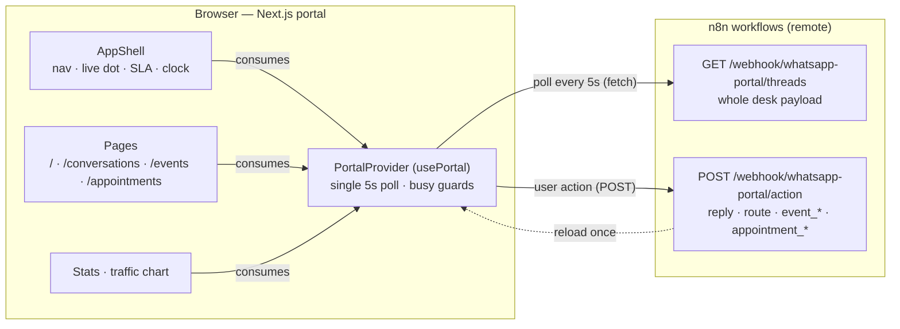
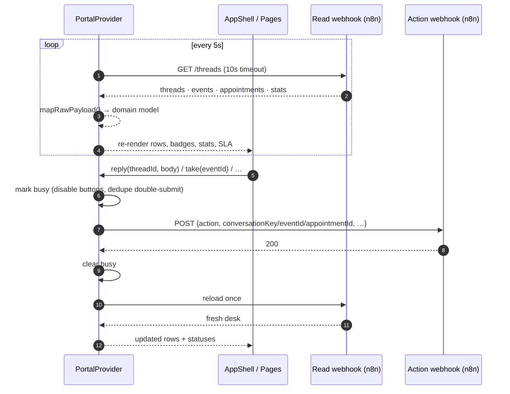
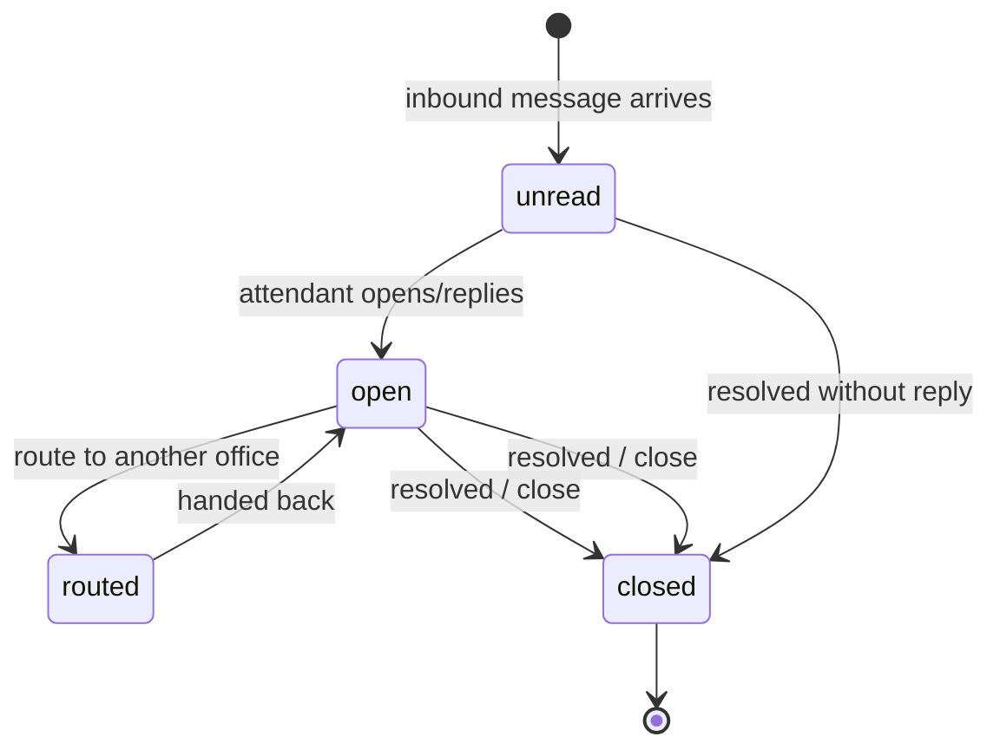
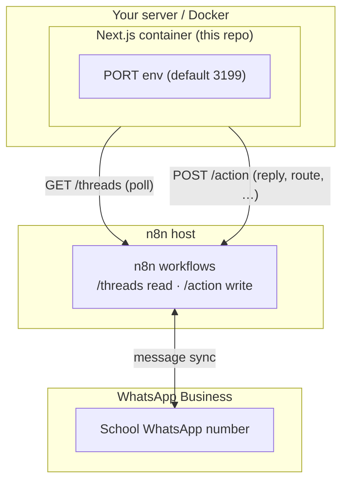

# WhatsApp School Office Portal

A standalone, deployable operations portal for the school WhatsApp number. It
is the morning office for the person who runs the front desk during school
hours: every parent message, staff event and appointment lands on one calm,
paper-and-ink desk.

This repository is **self-contained** — it was extracted from a larger
monorepo and has no dependency on that parent repo. It talks only to the two
n8n webhook endpoints described below.

## What the business owner is buying

This is a school operations desk, not just a dashboard:

- **One queue for every parent conversation** so the oldest unanswered work is
  visible first.
- **A traceable office workflow** for replies, routing, escalation, closure,
  staff events, and appointment requests.
- **WhatsApp-to-office continuity**: inbound messages, AI follow-up, events,
  appointments, and staff replies share the same n8n data layer.
- **A calm customer-facing surface** that works on a laptop at the front desk
  and on a phone during school rounds.
- **A deployable handoff**: Docker, environment template, offline tests, demo
  scripts, and a documented webhook contract are included.

The product deliberately keeps WhatsApp credentials in n8n, never in this
browser repository. Before a customer demonstration, verify the WhatsApp API
credential in n8n and send one test reply from the office portal.

## Customer demonstration in five minutes

1. Open the portal on the main screen: `/` shows the office queue.
2. Open `/conversations` and select the seeded parent thread.
3. Reply as the office: confirm the message appears in WhatsApp and in the
   thread timeline.
4. Open `/events`: take or resolve the generated staff follow-up.
5. Open `/appointments`: confirm or decline an appointment request.
6. Explain the value: the owner sees the same work queue that staff act on,
   instead of searching through a personal WhatsApp inbox.

For a repeatable parent/visitor script and copy-paste requests, see
[`CUSTOMER_DEMO.md`](./CUSTOMER_DEMO.md). The live n8n demo workflow is safe:
it returns simulated answers and does not send WhatsApp messages or write
school records.

Live demo workflow: `School Office Customer Demo` (`pEx4LoXFx31HW1aS`).

## WhatsApp prompt bank for customer demos

Use these as spoken or typed WhatsApp messages. Start with one short prompt,
let the agent answer, then continue with the follow-up. The strongest demo is
not a long scripted paragraph — it is showing that the agent remembers context,
asks for missing details, creates a useful office record, and keeps staff work
visible in the portal.

### High-value everyday prompts

| Say this to the agent | Show the customer |
|---|---|
| “What documents do I need for admission to Grade 3?” | A parent gets an immediate, plain-language admissions answer. |
| “What are the school timings, office hours, and after-school care timings?” | One place for routine questions that otherwise interrupt the office. |
| “Can you explain the fees for Nursery and what is paid once versus yearly?” | Consistent fee guidance with a clear handoff when exact figures need confirmation. |
| “My child will be absent today. Please let the school office know.” | The message becomes visible to staff as an operational request. |
| “I need to speak to the admissions office about joining next term.” | A natural conversation becomes a traceable office follow-up. |
| “Can I book an appointment about admission queries?” | The agent asks for the purpose, preferred slot, and parent/student details. |
| “3rd August 2026 at 3pm. Student: Rishit Singh. Parent: Poonam Singh.” | The follow-up completes the appointment record; open `/appointments` to show it. |
| “I need to change the pickup arrangement for my child today.” | A time-sensitive parent request is routed to the office queue. |

### Stronger multi-turn demos

1. **Admissions conversion**

   ```text
   I am moving my child to your school next term. What documents and fees should I prepare?
   ```

   Follow with:

   ```text
   Please book an admissions meeting for 10 August at 4pm. Student: Aarav Mehta. Parent: Neha Mehta.
   ```

   Show the answer first, then `/appointments` and the linked conversation in
   `/conversations`. This demonstrates information, intent capture, and office
   handoff in one journey.

2. **Parent support triage**

   ```text
   My daughter is absent today and I also need to ask about the school bus for tomorrow.
   ```

   Follow with:

   ```text
   Please send the bus question to the transport office and keep the absence noted for the front desk.
   ```

   Show `/conversations` and `/events` to demonstrate that one parent message
   can produce separate, actionable office work instead of disappearing in a
   chat history.

3. **Principal escalation with context**

   ```text
   I need to report a serious concern about a teacher. I do not want to repeat the details to several people.
   ```

   Follow with:

   ```text
   The teacher is Mr Sharma, my child is Rishit Singh, and it happened today. Please mark this urgent and ask the principal's office to follow up privately.
   ```

   Show the priority event and the original conversation together. For a real
   incident, never use the demo environment as the only reporting channel;
   confirm the school's safeguarding procedure as well.

4. **Complex office-day request**

   ```text
   I have three things: tell me the Grade 5 admission documents, note that my son will be absent tomorrow, and help me book a meeting with admissions next Tuesday afternoon.
   ```

   When the agent asks for details, reply:

   ```text
   Student: Kabir Mehta. Parent: Poonam Mehta. Book the meeting for 3pm if available.
   ```

   Show the conversation, event/request, and appointment views in sequence.
   This is the best “replace several phone calls” demonstration.

### Clarification and resilience prompts

These are useful when a prospect asks whether the system behaves safely:

```text
Book an appointment for tomorrow morning.
```

Then provide the parent and student names only after the agent asks. This shows
that the agent can gather missing fields instead of inventing them.

```text
Book an appointment for yesterday at 3pm.
```

Use this to demonstrate that a production setup should ask for a corrected
future slot rather than silently creating a past booking.

```text
My child is being bullied and I need the school to call me privately.
```

Use this to demonstrate sensitive escalation and honest handoff language. Do
not use fabricated names or details in a real safeguarding conversation.

### Demo discipline

- Use a realistic parent name and student name, then reuse them in the follow-up.
- Give the agent one turn to ask clarifying questions; do not paste every field
  in the first message unless demonstrating a structured booking.
- After a successful action, show the matching portal view: conversations,
  events, or appointments. The visible office record is the proof of value.
- For complex prompts, explain that the demo is showing orchestration and
  handoff; confirm exact school policy, fees, availability, and safeguarding
  procedure before production use.

- **Framework:** Next.js 15 (App Router) + React 19, plain CSS, no UI
  framework, no chart library, no auth.
- **Design contract:** [`DESIGN.md`](./DESIGN.md) — editorial school-office
  desk, paper/ink/green palette, calm borders/surface layering, 24h
  timestamps, responsive.
- **Routes:** `/`, `/conversations`, `/events`, `/appointments`.

---

## Architecture

The portal is a **single-page-state client**: one shared `PortalProvider`
polls the n8n read webhook every 5 seconds and owns the whole desk (threads,
events, appointments, stats). The app shell and every page consume that one
state source through `usePortal()` — there is no second poll loop anywhere.
Every office action (reply, route, close, take, resolve, confirm…) POSTs a
small JSON body to the n8n action webhook, then the provider reloads once.



### Poll / action data flow



### Thread state model



### Deployment topology



---

## Routes

| Route | What it shows | Actions |
|---|---|---|
| `/` | Overview: metrics, traffic chart, today's queue (SLA order), open events, upcoming appointments | Reply / Route / Escalate / Close from the thread drawer; Take / Escalate / Resolve / Cancel on events; Confirm / Decline on appointments |
| `/conversations` | Every thread, filterable by status (`?thread=` deep-links a conversation) | Same thread actions |
| `/events` | Every staff event, filterable by status | Take / Escalate / Resolve / Cancel |
| `/appointments` | Every appointment, upcoming first then past, filterable by status | Confirm / Decline / Complete |

---

## Environment

Both webhook URLs are `NEXT_PUBLIC_*` and **baked into the client bundle at
build time** — they are not read at runtime. No credentials or secrets live
in this repo; the workflows themselves hold any auth.

| Variable | Required | Description |
|---|---|---|
| `NEXT_PUBLIC_WHATSAPP_PORTAL_READ_API_URL` | Yes | Read webhook returning the whole desk payload (see `lib/data.ts` for the wire shape) |
| `NEXT_PUBLIC_WHATSAPP_PORTAL_ACTION_API_URL` | Yes | Action webhook accepting the `{action, …}` POST bodies |
| `PORT` | No | Runtime port for `next start` / Docker (default **3199**) |

Copy `.env.example` to `.env.local` and fill in the URLs:

```bash
cp .env.example .env.local
```

### Production checklist

- [ ] `NEXT_PUBLIC_WHATSAPP_PORTAL_READ_API_URL` points to the production read
  webhook.
- [ ] `NEXT_PUBLIC_WHATSAPP_PORTAL_ACTION_API_URL` points to the production
  action webhook.
- [ ] The n8n WhatsApp credential is connected and its Meta token is valid.
- [ ] The n8n portal action workflow returns `200` for a safe `reply` test.
- [ ] CORS allows the deployed portal origin.
- [ ] A real inbound message appears in `/conversations`.
- [ ] A real office reply reaches WhatsApp before the customer demo begins.

---

## Local development

Requires Node.js 20.9+ (22 LTS recommended).

```bash
npm install
npm run dev        # http://localhost:3000
```

Useful operator commands:

```bash
npm run typecheck       # TypeScript contract check
npm test                # Offline unit tests
npm run build           # Production build
npm run test:e2e        # Local mock-server browser flow
npm run demo:parent     # Print a parent demo request
npm run demo:visitor    # Print a visitor demo request
```

The live demo workflow endpoint is documented in `CUSTOMER_DEMO.md`; it is a
safe, credential-free showcase path separate from the production school action
webhook.

Without `.env.local` the portal renders the loading/error states cleanly but
cannot load data — the URL env vars are required to see the desk.

---

## Tests

Everything runs **offline** — no live webhooks are contacted by any test.

| Command | What it runs |
|---|---|
| `npm run typecheck` | `tsc --noEmit` across the app and tests |
| `npm test` | `node:test` + `tsx` unit tests: formatters, queue/pulse/appointment logic, live payload mapping, action payload contracts |
| `npm run build` | Production build |
| `npm run test:e2e` | Builds against a local mock HTTP server, serves all four routes, asserts **no action POST is issued** by page loads |
| `python scripts/browser-smoke.py` | Optional (dev tooling): Playwright check of all routes at desktop + mobile widths for hydration, horizontal overflow, console errors, and zero action POSTs; screenshots to the system temp dir |

The unit tests pin the pure logic that the UI depends on:

- `tests/format.test.ts` — time/age/initials formatters
- `tests/logic.test.ts` — queue ordering, pulse rail state, appointment
  splitting, busiest-hour derivation, SLA summary
- `tests/mapping.test.ts` — `mapRawPayload` wire-shape → domain model,
  including fallbacks and empty payloads
- `tests/actions.test.ts` — the exact JSON bodies POSTed to the action
  webhook (the workflow contract)

---

## Deployment

### Docker

```bash
# The NEXT_PUBLIC_* values are inlined at build time — pass them as args.
docker build \
  --build-arg NEXT_PUBLIC_WHATSAPP_PORTAL_READ_API_URL=https://n8n.example.com/webhook/whatsapp-portal/threads \
  --build-arg NEXT_PUBLIC_WHATSAPP_PORTAL_ACTION_API_URL=https://n8n.example.com/webhook/whatsapp-portal/action \
  -t whatsapp-workflow .

# PORT is read at runtime by `next start` (default 3199, change freely).
docker run -p 3199:3199 -e PORT=3199 whatsapp-workflow
```

The `PORT` env var is **not** hardcoded anywhere — change it at runtime and
map the container port to match.

### Plain Node

```bash
npm ci
cp .env.example .env.local   # fill both NEXT_PUBLIC_* URLs
npm run build
PORT=3199 npm start
```

### Recommended customer handoff

1. Create a customer-specific `.env.local` from `.env.example`.
2. Build once with the customer's production webhook URLs.
3. Run `npm run typecheck`, `npm test`, `npm run build`, and
   `npm run test:e2e`.
4. Deploy the image behind HTTPS and a small reverse proxy.
5. Send one real office reply and one parent inbound message.
6. Hand the owner `CUSTOMER_DEMO.md` as the first-day operating guide.

The public portal contains no WhatsApp token, Meta secret, n8n API key, or
database credential. Those belong in n8n's credential store and server-side
environment configuration.

### Real deployment behavior (important)

- **Build-time baking:** the two `NEXT_PUBLIC_*` URLs are compiled into the
  JavaScript bundle. Changing the n8n endpoints means rebuilding and
  redeploying — the runtime `PORT` alone is not enough.
- **CORS:** the browser fetches the n8n webhooks cross-origin, so the n8n
  endpoints must send `Access-Control-Allow-Origin` for the portal's origin.
- **Polling:** the provider polls every 5 seconds. The read webhook should
  be cheap; if you scale the portal horizontally every instance polls, which
  is fine for a single office but worth knowing.
- **Timeouts:** every request aborts after 10 seconds (`AbortSignal.timeout`).
  A failed poll after a successful load flips the app bar to *Offline* and
  keeps showing the last data; a failed first load shows the error strip.

---

## Known limitations

- **No offline write queue.** If an action POST fails, the UI shows an error
  strip and you retry manually; the action is not replayed later.
- **Poll cadence is fixed** at 5s (constant in `lib/use-portal.tsx`); it is
  not configurable at runtime.
- **Optimistic UI is not used.** Rows update only after the follow-up reload
  completes, so there is a short delay between clicking an action and seeing
  the new state. Busy-guards prevent double-submits during that window.
- **The traffic chart shows what the read endpoint reports, with a demo fill.** Days
  with no recorded activity render zero-height bars, and an empty week shows
  an empty state. For customer demos, past days with zero activity get small
  deterministic placeholder bars (see `Stats.tsx`) so the chart looks alive;
  today's counts are always real. `busiestHour` falls back to a
  client-side derivation from today's inbound messages only when the endpoint
  omits it.
- **Light theme only** by design (see `DESIGN.md` section 14).
- **`next build` may print a "multiple lockfiles / workspace root" warning**
  if an unrelated `package-lock.json` exists in a parent directory of the
  checkout; it is cosmetic and does not affect the image or output.

---

## Repository layout

```
app/              pages (/, /conversations, /events, /appointments) + layout + CSS
components/       AppShell, lists, thread drawer, pulse rail, stats
lib/
  data.ts         fetch adapters, wire-shape mapping, action payload builders
  logic.ts        pure domain logic (queue, pulse, appointments, SLA, traffic)
  format.ts       pure presentational formatters
  types.ts        domain model
  use-portal.tsx  PortalProvider + usePortal (single poll/state source)
tests/            node:test offline suite
scripts/          e2e-smoke.mjs, browser-smoke.py (dev tooling)
Dockerfile        configurable PORT, build args for the webhook URLs
DESIGN.md         visual contract (single source of truth for look and feel)
```
